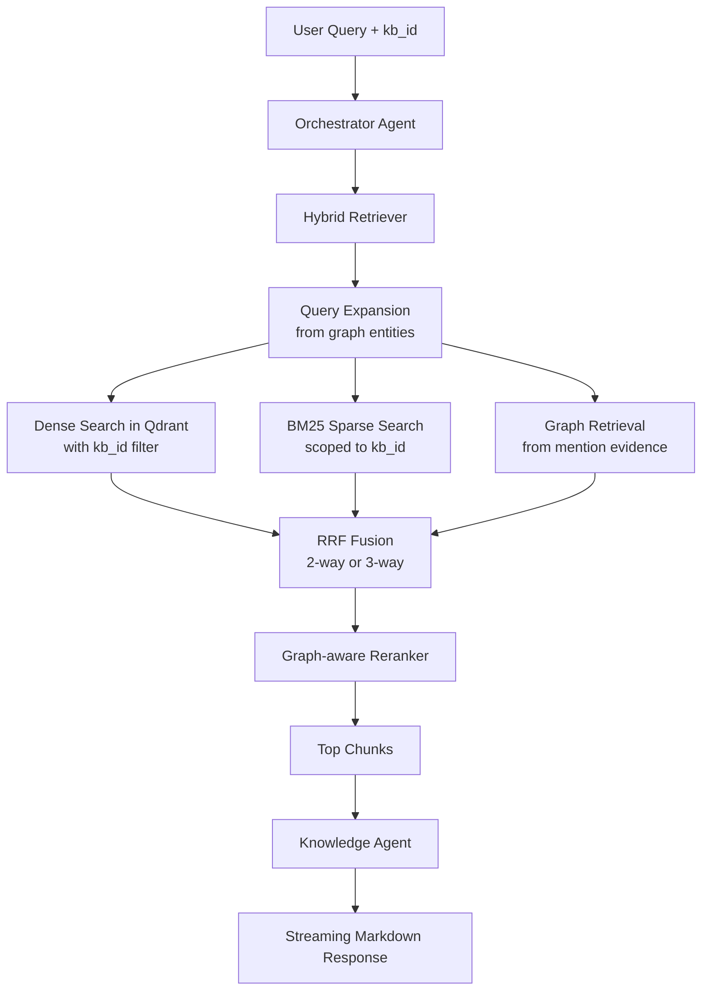
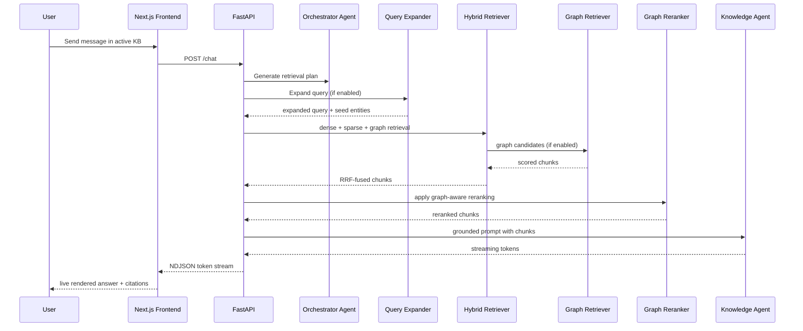

# nanoRAG — Architecture

nanoRAG is a minimal agentic RAG platform with a strict separation between retrieval and reasoning.

## Principles

- Retrieval is isolated from agents.
- Orchestration is intentionally small.
- Hybrid search is local and CPU-friendly.
- The backend stays monolithic and modular.
- The frontend is client-heavy, responsive and streaming-first.
- Multi-KB isolation uses metadata filtering, not per-KB infrastructure.
- Graph extraction is additive to retrieval, not a replacement.

## High-level components

- Frontend: Next.js App Router, React 19, TailwindCSS, shadcn-style primitives.
- Backend: FastAPI + Agno for agent execution.
- Vector search: Qdrant.
- Qdrant collection strategy: single shared `nanorag_chunks` collection.
- Sparse retrieval: local BM25 with rank-bm25.
- Fusion: Reciprocal Rank Fusion.
- Post-retrieval reranking: graph-aware bonus on chat candidates (configurable entity/relation weights).
- Query expansion: deterministic entity-label matching from the knowledge graph (opt-in).
- Graph retrieval: third retrieval channel pulling chunk candidates from graph mention evidence (opt-in).
- Graph store: SQLite (`knowledge_graph.db`) with mention-level entity and relation rows.
- Graph extraction: heuristic + structured LLM pipeline with canonicalization.
- Providers: OpenAI-compatible APIs and Ollama.
- KB metadata store: local JSON metadata for KBs and documents only.

## Retrieval flow

## Chat flow

## Storage policy

- Raw uploaded files are processed in-memory and are not retained after ingestion.
- Persisted data is limited to chunk metadata, dense vectors, sparse chunk store entries, KB records, and document records.
- This keeps the system simple while remaining compatible with future global multi-KB search.

## Simplicity boundaries

This version deliberately excludes:

- semantic chunking with LLMs
- planner agents
- distributed memory
- background job systems
- microservices

Current boundaries:

- reranking exists with configurable entity/relation weighting on chat candidates
- graph-driven query expansion and graph retrieval are implemented and opt-in
- the knowledge graph remains additive to hybrid retrieval rather than replacing it

## Knowledge Graph

The knowledge graph is extracted during ingestion and stored as mention-level
rows in SQLite (`backend/data/knowledge_graph.db`).

**Extraction:** two modes — heuristic (`graph_extractor.py`) and structured
LLM (`structured_graph_extractor.py`), selectable via `GRAPH_EXTRACTION_ENABLED`.
Entities and relations carry confidence scores; canonicalization is deterministic
and local (`graph_normalization.py`).

**Storage:** tables `entity_mentions` and `relation_mentions`, each scoped by
`kb_id` and `chunk_id`. Relations link source and target entities with a
predicate and confidence.

**Retrieval integration:** three complementary graph-powered features, all opt-in:

- **GraphReranker** — loads per-chunk graph summaries and applies a conservative
  bonus to chunks with stronger relation evidence. Default weights: retrieval
  75%, graph 25% — configurable per instance.
- **GraphQueryExpander** — tokenizes the query, matches tokens against entity
  labels in SQLite, appends canonical and neighbor labels. Deterministic,
  no LLM. Controlled by `GRAPH_QUERY_EXPANSION_ENABLED`.
- **GraphRetriever** — third retrieval channel that pulls chunk candidates
  directly from graph mention rows, scored by entity/relation mention counts
  weighted by confidence. Controlled by `GRAPH_RETRIEVAL_ENABLED`.

**Inspection APIs:** `GET /kb/{kb_id}/graph` returns an aggregate snapshot;
`GET /kb/{kb_id}/graph/node/{entity_id}` returns per-node detail with
evidence-backed relations, neighbor nodes, and backing documents.

**MCP tools:** `nanorag_get_graph` and `nanorag_get_node_detail` expose the
same inspection surface to external AI agents.
