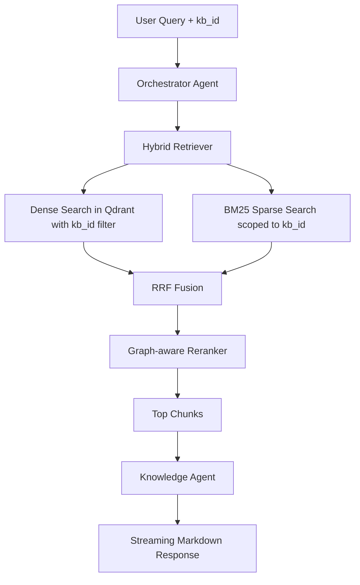
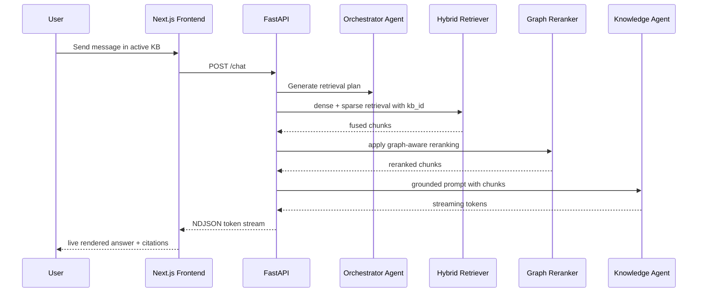

# Architecture

nanoRAG is a minimal agentic RAG platform with a strict separation between retrieval and reasoning.

## Principles

- Retrieval is isolated from agents.
- Orchestration is intentionally small.
- Hybrid search is local and CPU-friendly.
- The backend stays monolithic and modular.
- The frontend is client-heavy, responsive and streaming-first.
- Multi-KB isolation uses metadata filtering, not per-KB infrastructure.

## High-level components

- Frontend: Next.js App Router, React 19, TailwindCSS, shadcn-style primitives.
- Backend: FastAPI + Agno for agent execution.
- Vector search: Qdrant.
- Qdrant collection strategy: single shared `nanorag_chunks` collection.
- Sparse retrieval: local BM25 with rank-bm25.
- Fusion: Reciprocal Rank Fusion.
- Post-retrieval reranking: graph-aware bonus on chat candidates.
- Providers: OpenAI-compatible APIs and Ollama.
- KB metadata store: local JSON metadata for KBs and documents only.

## Retrieval flow

## Chat flow

## Storage policy

- Raw uploaded files are processed in-memory and are not retained after ingestion.
- Persisted data is limited to chunk metadata, dense vectors, sparse chunk store entries, KB records, and document records.
- This keeps the system simple while remaining compatible with future global multi-KB search.

## Simplicity boundaries

This version deliberately excludes:

- semantic chunking with LLMs
- planner agents
- distributed memory
- background job systems
- microservices

Current boundaries:

- reranking exists, but only as a minimal graph-aware pass on chat candidates
- there is still no graph-driven query expansion or graph-only retrieval
- the knowledge graph remains additive to hybrid retrieval rather than replacing it
