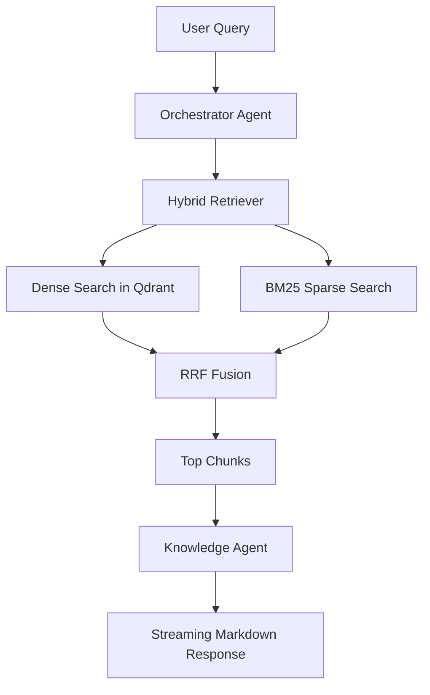
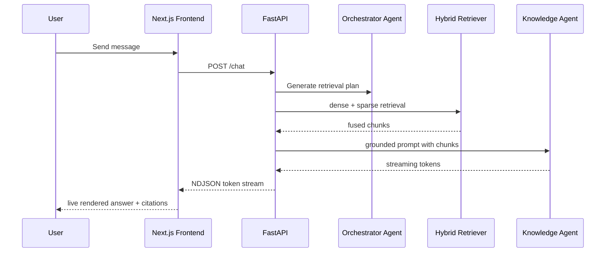

# Architecture

nanoRAG is a minimal agentic RAG platform with a strict separation between retrieval and reasoning.

## Principles

- Retrieval is isolated from agents.
- Orchestration is intentionally small.
- Hybrid search is local and CPU-friendly.
- The backend stays monolithic and modular.
- The frontend is client-heavy, responsive and streaming-first.

## High-level components

- Frontend: Next.js App Router, React 19, TailwindCSS, shadcn-style primitives.
- Backend: FastAPI + Agno for agent execution.
- Vector search: Qdrant.
- Sparse retrieval: local BM25 with rank-bm25.
- Fusion: Reciprocal Rank Fusion.
- Providers: OpenAI-compatible APIs and Ollama.

## Retrieval flow

## Chat flow

## Simplicity boundaries

This version deliberately excludes:

- semantic chunking with LLMs
- reranking
- planner agents
- distributed memory
- background job systems
- microservices
